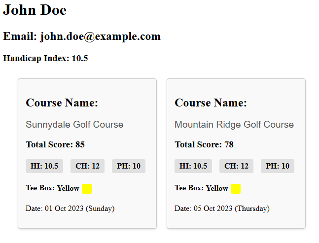
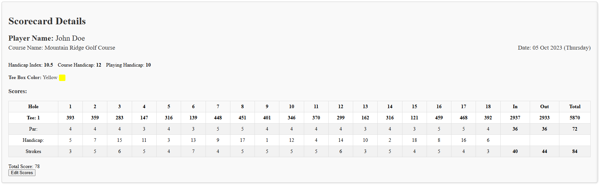

# Golf Scorecard Application

A comprehensive Node.js CRUD application with an Angular frontend, designed for tracking golf scores, managing players, and maintaining scorecards for both 9-hole and 18-hole games. The application is structured with a robust backend using Node.js and Express, coupled with an interactive Angular frontend to provide an intuitive user experience.

## Application Overview

The application features a user-friendly interface that allows players to create and manage their profiles, as well as track their golf scores effectively.

### Player Profile Summary

The above image illustrates a **Player Profile**, showcasing the essential details of a player, including their name, email, and handicap index. This profile is crucial for personalizing the golfing experience and tracking each player's performance over time.

### Detailed Scorecard

The **Detailed Scorecard** shown in the image above provides a comprehensive overview of a player's performance during a golf game. It includes information such as the score for each hole, the total strokes taken, and other relevant statistics for both 9-hole and 18-hole games. This feature allows players to analyze their performance and identify areas for improvement.

## Table of Contents

- [Features](#features)
- [Technologies Used](#technologies-used)
- [Application Structure](#application-structure)
- [Usage](#usage)

## Features

- Player Management: Add, update, delete, and retrieve player details, including name, email, and handicap index.
- Scorecard Management: Create, update, delete, and retrieve scorecards, with support for both 9-hole and 18-hole games.
- Group Games: Track group games involving multiple players on various golf courses.
- Seeding Data: Database seeding functionality to populate initial data for players, scorecards, and group games.
- Data Storage: Uses SQLite for lightweight, local data storage and persistence.
- Frontend: An Angular-based frontend for an interactive and streamlined user experience when managing scores and players.

## Technologies Used

- Backend: Node.js, Express.js
- Database: SQLite
- Frontend: Angular
- Languages: JavaScript, TypeScript
- Data Format: JSON

## Application Structure
- /models: Contains data models, such as Player, Scorecard, and GroupGame.
- /services: Business logic for handling CRUD operations for players, scorecards, and group games.
- /repositories: Data access layer for interacting with the SQLite database.
- /database/entities: Database entity classes for defining data structure.
- /routes: Express routes for API endpoints.
- /frontend: Angular frontend application to interact with the backend services.
- /seeds: Data seeder scripts to populate the database with initial data.
  
## Usage
- Manage Players: Add, edit, or delete player details through the API or Angular frontend.
- Track Scores: Add scores for each hole, view summary scorecards, and track overall game progress.
- Organize Group Games: Create group games with multiple players, golf courses, and scorecards.